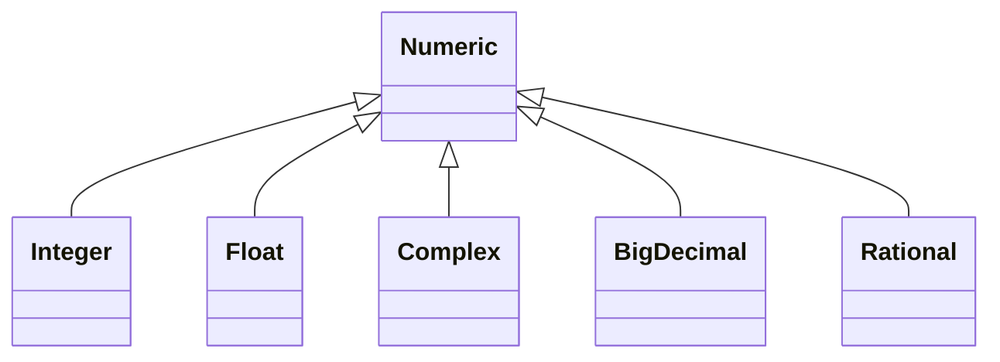

# Ruby Programming Language

[Ruby](https://www.ruby-lang.org/) 是來自日本的程式語言，發明者是[松本行弘 (Yukihiro Matsumoto)](https://matz.rubyist.net/)。在 2007 年因為 Ruby on Rails (簡稱 RoR ) 的風潮，第一次聽到這個語言，沒有深入使用，現在因為想展開第二曲線 (The Second Curve)，選了這個 **程式設計師的摯友 (A Programmer's Best Friend)** 來學習 (這是官網的標題)。

> Ruby 的設計精神：Ruby is designed to make programmers happy.

也就是說，用了 Ruby 會更快樂！在松本行弘的書上也說，Ruby 可以提高生產力，看來不錯，要試試看才知道。自己想到一個問題：學習 Ruby 程式到有生產力，我需要花多少時間？

學習一個程式語言到具有生產力，大概需要：
1. 程式語言的語法，如資料型別、判斷、迴圈。
2. 程式語言的組織架構，如模組、副程式。
3. 相關程式庫和套件管理系統。
4. 如何除錯 debug。
5. 如何發行佈署。

以每天投入 2 小時，有沒有可能在 30 天內學會 Ruby 用來生產軟體呢？ 對於有經驗的程式開發者，我想應該不難吧。

## 從 0 到 1

先安裝 Ruby，自己的系統是 Microsoft Windows 10，所以使用 [RubyInstaller](https://rubyinstaller.org/) ，下載 Ruby+Devkit 2.7.X (x64) 安裝程式，目前已經有 Ruby 3.0 ，考量套件相容等因素，對於學習者來說別自找麻煩(太新的東西不要用)。

什麼是 Devkit？ Devkit 是開發套件 (development kit) 的意思，RubyInstaller 用的是 MSYS2 當作開發套件。因為安裝 Ruby 的擴充套件可能需要編譯原始碼後才能使用，因此會需要開發套件。

執行 RubyInstaller 預設是安裝在 C:\Ruby27-x64 路徑下，安裝完成後，程式會提示「Run 'ridk install' to set up MSYS2 and development toolchain.」，請打勾後結束，會跳出 cmd 視窗按下 Enter 安裝 toolchain。

一切都安裝完成之後，開啟 Command Prompt 試試看，輸入 `ruby -v` 顯示 Ruby 版本，大概會輸出 `ruby 2.7.5p203 (2021-11-24 revision f69aeb8314) [x64-mingw32]` 這樣的結果。

ruby 是執行 Ruby 程式語言的直譯器 (interpreter)，若要知道如何使用，輸入 `ruby -h` 顯示使用說明，內容如下：

```
Usage: C:\Ruby27-x64\bin\ruby.exe [switches] [--] [programfile] [arguments]
  -0[octal]       specify record separator (\0, if no argument)
  -a              autosplit mode with -n or -p (splits $_ into $F)
  -c              check syntax only
  -Cdirectory     cd to directory before executing your script
  -d              set debugging flags (set $DEBUG to true)
  -e 'command'    one line of script. Several -e's allowed. Omit [programfile]
  -Eex[:in]       specify the default external and internal character encodings
  -Fpattern       split() pattern for autosplit (-a)
  -i[extension]   edit ARGV files in place (make backup if extension supplied)
  -Idirectory     specify $LOAD_PATH directory (may be used more than once)
  -l              enable line ending processing
  -n              assume 'while gets(); ... end' loop around your script
  -p              assume loop like -n but print line also like sed
  -rlibrary       require the library before executing your script
  -s              enable some switch parsing for switches after script name
  -S              look for the script using PATH environment variable
  -v              print the version number, then turn on verbose mode
  -w              turn warnings on for your script
  -W[level=2|:category]     set warning level; 0=silence, 1=medium, 2=verbose
  -x[directory]   strip off text before #!ruby line and perhaps cd to directory
  --jit           enable JIT with default options (experimental)
  --jit-[option]  enable JIT with an option (experimental)
  -h              show this message, --help for more info
```

也可以試試 Ruby 的套件管理 RubyGems，輸入 `gem -v` 顯示版本，或是 `gem -h` 顯示 help 說明，內容如下：

```
RubyGems is a sophisticated package manager for Ruby.  This is a
basic help message containing pointers to more information.

  Usage:
    gem -h/--help
    gem -v/--version
    gem command [arguments...] [options...]

  Examples:
    gem install rake
    gem list --local
    gem build package.gemspec
    gem help install

  Further help:
    gem help commands            list all 'gem' commands
    gem help examples            show some examples of usage
    gem help gem_dependencies    gem dependencies file guide
    gem help platforms           gem platforms guide
    gem help <COMMAND>           show help on COMMAND
                                   (e.g. 'gem help install')
    gem server                   present a web page at
                                 http://localhost:8808/
                                 with info about installed gems
  Further information:
    https://guides.rubygems.org
```

還有一個工具可以執行 Ruby 運算式，就是 [Interactive Ruby, IRB](https://docs.ruby-lang.org/en/2.7.0/IRB.html)，開啟 Command Prompt 輸入 irb 執行，如果要離開互動模式，輸入 exit 或按鍵 Ctrl + D 就可以了。

## Hello, World!

第一個程式「Hello, World!」，可以開啟 Interactive Ruby (C:\Ruby27-x64\bin\irb.cmd) 輸入執行，程式碼如下：

```ruby
puts "Hello, World!"    # 這是第一個用 Ruby 寫的程式
```

`puts` 是一個 function，用途是把字串印出來，並且在字串後面加上換行 (newline)。除了用 `puts` 印東西，還可以用 `print` 和 `p` 。

寫到這邊發現一個問題，`puts` 是和 Python 的 `print` 類似的內建函式嗎？不需要引入任何程式庫就可以使用了嗎？

的確，原來是 Ruby 直譯器會自動載入 [Kernel](https://docs.ruby-lang.org/en/2.7.0/Kernel.html) 模組，`puts`, `print`, `p` 都是 Public Instance Method。

如果想要知道 Ruby 執行時有哪些模組可用，請呼叫 `Module.constants` 這個 Public Class Method 檢視，Kernel 就是其中之一。

回到 `puts`, `print`, `p` 這三個 function，差別在於：

* `puts` 等於是呼叫 `$stdout.puts`，`$stdout` 是全域變數之一，代表目前的 STDOUT。(要知道有哪些全域變數，直接呼叫 `global_variables` 可以知道)
* `print` 是 Kernel 模組的方法之一，把物件輸出到 `$stdout`。
* `p` 也是 Kernel 模組的方法之一，呼叫每個物件的 `inspect` 方法。

這邊提到 `$stdout` 這個變數， Ruby 的變數不用是「$」開頭 (但 PHP 就必須是)，錢符號 (dollar sign) 代表是「全域變數」，相當好的語言設計，看名稱就知道範疇。

## 註解 (Comments)

Ruby 的程式碼有兩種使用[註解](https://docs.ruby-lang.org/en/2.7.0/syntax/comments_rdoc.html)的方法：**行內 (inline)** 和**區塊 (block)**。

```ruby
# 這是行內註解
    # 行內註解可以縮排，也可以在每行程式碼的結尾

=begin
這是區塊註解，用 =begin 開頭和 =end 結尾，把註解內容包起來。
注意！
1. =begin 和 =end 一定要在每行的開頭，不可以有縮排。
2. 沒有 C style 的 /* ...... */ 這種多行註解方式。
=end
```

## 關鍵字 (Keywords)

1. __ENCODING__
2. __LINE__
3. __FILE__
4. BEGIN
5. END
6. alias
7. and
8. begin
9. break
10. case
11. class
12. def
13. defined?
14. do
15. else
16. elsif
17. end
18. ensure
19. false
20. for
21. if
22. in
23. module
24. next
25. nil
26. not
27. or
28. redo
29. rescue
30. retry
31. return
32. self
33. super
34. then
35. true
36. undef
37. unless
38. until
39. when
40. while
41. yield

## 資料類型 (Data Type)

了解程式語言的第一步，先從程式語言所提供的資料類型開始，我們需要知道幾件事情：

1. 資料類型的用途，可以做什麼。
2. 資料類型的使用情境，什麼時候適合採用，限制有哪些。
3. 資料類型之間的轉換方式。
4. 特別要注意的地方，刻意記下來，避免發生 bug。

### 數值 (Number)



* 數字 [Numeric](https://docs.ruby-lang.org/en/2.7.0/Numeric.html)
  * 整數 [Integer](https://docs.ruby-lang.org/en/2.7.0/Integer.html)
  * 雙精度浮點數 [Float](https://docs.ruby-lang.org/en/2.7.0/Float.html)
  * 複數 [Complex](https://docs.ruby-lang.org/en/2.7.0/Complex.html)
  * 高精度十進制小數 [BigDecimal](https://docs.ruby-lang.org/en/2.7.0/BigDecimal.html)
  * 有理數 [Rational](https://docs.ruby-lang.org/en/2.7.0/Rational.html)

注意！所有 Numeric 類別的物件，都是不可變的 (immutable)。

Integer 以前有兩個子類別：[Fixnum](https://docs.ruby-lang.org/en/2.3.0/Fixnum.html) 和 [Bignum](https://docs.ruby-lang.org/en/2.3.0/Bignum.html)，不過在 Ruby 2.4 以後已經統一到 Integer 類別中，移除了 Fixnum 和 Bignum 兩個類別，在網路上的資料有可能還會看到，需要特別注意。

Integer 和 BigDecimal 的數值是沒有範圍限制，Float 是 IEEE 754 雙精度浮點數。至於 Complex 和 Rational 則是 Integer 和 Float 的組合，那範圍限制呢？

## Ruby 程式語言重點

* 動態語言 (dynamic language)，變數使用前不需要先宣告。
* 手稿語言 (scripting language)，不需要編譯。
* 完全地物件導向！所有東西都是物件。不像其他語言有非物件的基本型別。
* 呼叫函式或方法，可以不需要括弧。因為 Ruby 設計上不允許直接存取物件的屬性，需要透過存取方法 (accessor method)，換句話說，取得物件的屬性等於呼叫getter，忽略括弧吧！
* Ruby 是區分大小寫 (case-sensitive) 的程式語言，識別碼 (identifier) 的大寫和小寫是不相同的。另外，像 SQL 和 HTML 就是不區分大小寫的語言。

# 參考資料
* David Flanagan and Yukihiro Matsumoto, The Ruby Programming Language, O'Reilly Media, 2008
* [Documentation for Ruby 2.7.0](https://docs.ruby-lang.org/en/2.7.0/)
